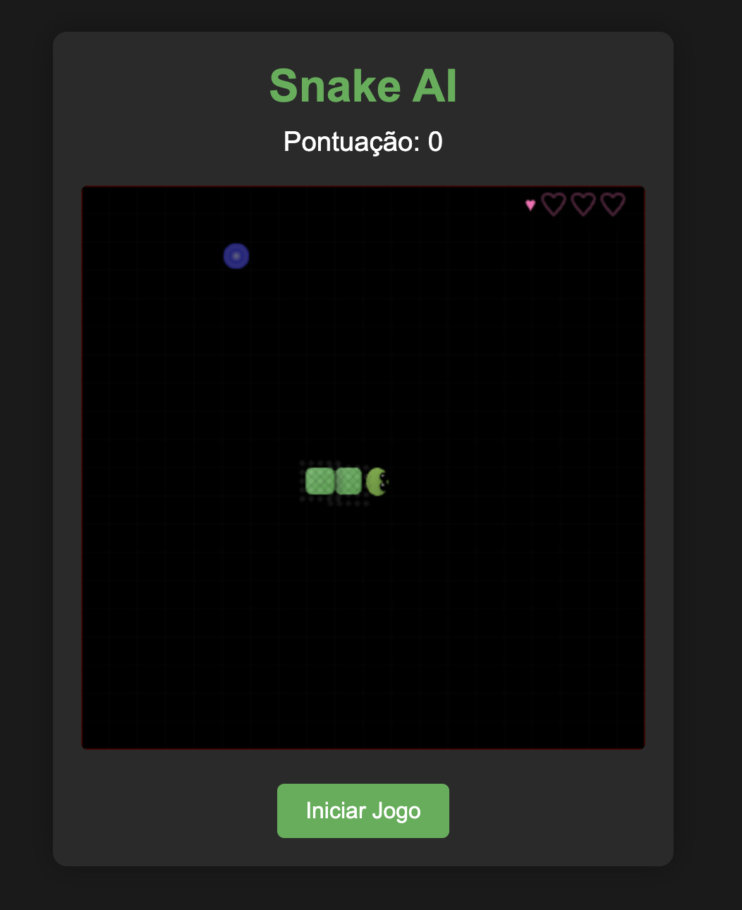
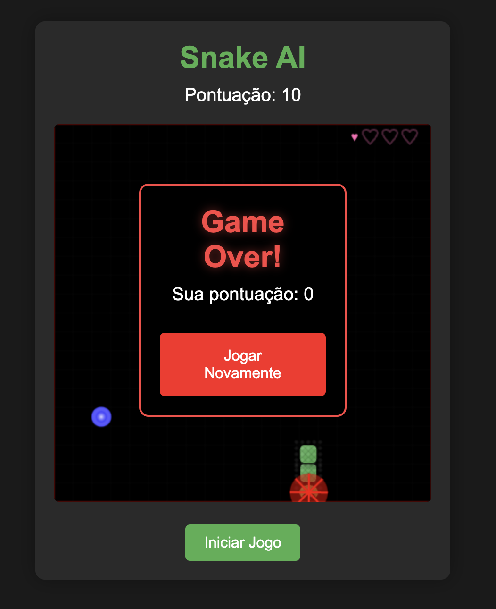

# Snake AI 🐍

A modern Snake game built with vanilla JavaScript and HTML5 Canvas, featuring special effects and power-ups.

## Features

- 🎮 Modern visual effects and animations
- 🌟 Power-ups (Special stars, Hearts, Bombs)
- 📈 Progressive difficulty
- 📱 Responsive design (desktop & mobile)
- 💖 Multiple lives system
- 🎨 Snake evolution based on score

## Getting Started

1. Clone the repository
2. Open `index.html` in your browser
3. Use arrow keys or WASD to control the snake
4. Collect food to grow and score points
5. Avoid bombs and collect hearts for extra lives

## Technologies

- JavaScript (No frameworks)
- HTML5 Canvas
- CSS3 Animations

## Project Status

This is an ongoing project created in collaboration with AI (GitHub Copilot). Feel free to use it as a starting point for your own projects or contribute to its development.

## Controls

- Arrow keys / WASD: Move snake
- Touch controls available on mobile
- Click/Tap "Start Game" to begin

## License

Open source under MIT License.

---

Made with ❤️ and AI assistance